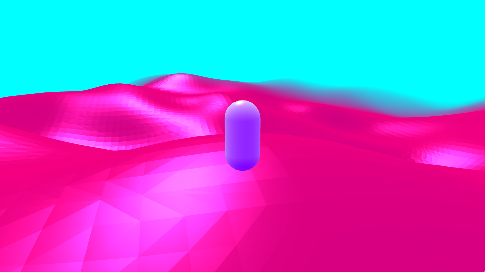

# Marching Cubes (still looking for a cool project name)



## Run the project

### Dev Container (recommanded)

**required :**

-   Docker
-   VsCode [Dev Container](https://marketplace.visualstudio.com/items?itemName=ms-vscode-remote.remote-containers) extension

This project can run in a [devcontainer](https://code.visualstudio.com/docs/devcontainers/tutorial).

Once clonned, open it in vscode, use `CTRL+Shift+P` and search for **Reopen in container**. Click on it and VsCode will reopen the project in a container and start it (It will be available at `http://127.0.0.1:5173`).

### Manual

**required :**

-   Node

```
npm i
npm run dev
```

## Controls

Move with `w`,`a`,`s`,`d` or the `arrow keys`.

Look arround by clicking and dragging the mouse.

**Wait for the ground to generate before jumping from the starting platform** (I should had a loader someday)
